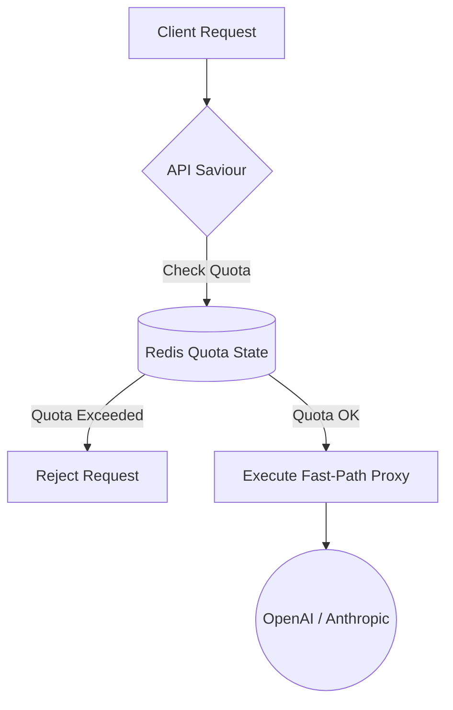

## The Edge Control Plane

API Saviour is a production-grade AI API gateway designed to act as an un-bypassable control plane sitting between internal enterprise applications and external LLM providers (e.g., OpenAI, Anthropic, Google). 

As we scaled, traffic hit a critical mass: 15 completely disconnected AI integrations across 4 separate teams. Without centralized governance, the cloud compute budget ballooned unpredictably, and PII management became a "blind trust" scenario. The solution wasn't to slow down the teams, but to build a choke point that forces all outgoing LLM traffic through a strict gauntlet.

### Core Architecture

The system is fundamentally bifurcated into two pathways to ensure near-zero added latency on token generation:

1. **The Fast-Path Proxy Engine:** Written in TypeScript and deployed on edge infrastructure, this layer proxies the socket streams directly to the LLMs.
2. **The Slow-Path Telemetry:** Asynchronous background workers pull event logs from the proxy stream, drop them into a Redis buffer ring, and batch-persist them to PostgreSQL.

This bifurcation ensures that even if our telemetry database suffers an outage, the proxy network continues to route traffic uninterrupted.

### Programmable Plugin Engine

Instead of hardcoding every possible requirement, I implemented an edge-level code editor and a plugin marketplace. 

```typescript
// Example: A runtime PII scrubbing plugin written in TypeScript
export const PIIScrubberPlugin: EdgePlugin = {
  id: 'pii-mask-v2',
  priority: 10,
  beforeEgress: async (req, ctx) => {
    // Regex matches Social Security Numbers and Redacts them
    const safePayload = req.body.replace(/\b\d{3}-\d{2}-\d{4}\b/g, '[REDACTED_SSN]');
    return { ...req, body: safePayload };
  }
}
```

This effectively shifted governance out of the code-review phase and into a dedicated runtime policy layer. You can write a 5-line TypeScript plugin to regex-mask SSNs or implement a sophisticated sliding-window rate limit by user IP, and deploy it instantly across the network without a rolling restart.

### The Budget Controller



The system implements Hard and Soft quotas enforced on a per-team API key basis. 

*   **Soft Caps:** Trigger asynchronous Slack webhook alerts indicating a team has burned 80% of their daily allocation.
*   **Hard Caps (Emergency Kill-Switch):** Instantly rejects the request at the edge with a `429 Too Many Requests` envelope.

### Outcomes

By decoupling the governance from the product teams, we achieved the following results within the first 30 days of deployment:

*   **Reduced PII leaks to zero** using regex and deterministic token masking.
*   **Cut overall API costs by 24%** by mapping identical queries through a Redis semantic cache before they hit the egress network.
*   **Established 100% Observability:** Every token generated is traced, costed, and aggregated into a comprehensive admin telemetry dashboard.

> [!NOTE]
> API Saviour proves that robust security infrastructure does not need to compromise product iteration velocity. It acts as our AI firewall, providing safety guarantees entirely transparently to the calling application.
