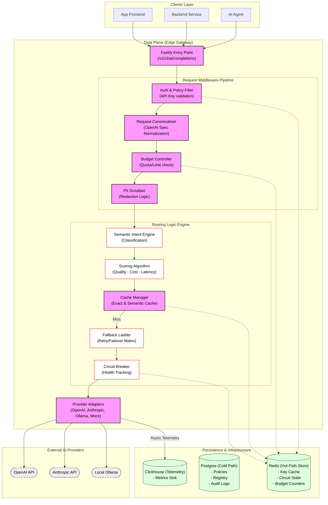

## The Edge Control Plane

API Saviour is a production-grade AI API gateway designed to act as an **un-bypassable control plane** sitting between internal enterprise applications and external LLM providers (e.g., OpenAI, Anthropic, Google). 

As we scaled, traffic hit a critical mass: 15 completely disconnected AI integrations across 4 separate teams. Without centralized governance, the cloud compute budget ballooned unpredictably, and PII management became a "blind trust" scenario. The solution wasn't to slow down the teams, but to build a **choke point** that forces all outgoing LLM traffic through a strict architectural gauntlet.

---

### High-Level Architecture

The system is split into a high-performance **Data Plane** (the edge gateway) and a feature-rich **Control Plane** (the admin console). This separation ensures that management overhead never impacts the latency of the token generation hot-path.



---

### The Request Lifecycle

Every request is normalized into a `RequestHash` which serves as a canonical fingerprint for caching and budget enforcement. The following sequence traces a request as it traverses the data plane.

```mermaid
sequenceDiagram
    participant Client
    participant GW as Gateway (Fastify)
    participant Redis
    participant Router as Routing Engine
    participant Multi as Multi-Provider Ladder
    participant Provider as AI Provider (e.g. Anthropic)
    participant Telemetry as Telemetry Sink (Clickhouse)

    Note over Client, GW: Integrated via OpenAI SDK
    Client->>+GW: POST /v1/chat/completions
    
    rect rgb(30, 30, 40)
        Note right of GW: Middleware Phase
        GW->>Redis: Get Key Metadata (Hash)
        Redis-->>GW: Key Validated (Tenant X)
        GW->>GW: Canonicalize Payload
        GW->>Redis: Check Quota (Daily Spend)
        Redis-->>GW: Budget OK
        GW->>GW: PII Scrubbing
    end

    rect rgb(40, 30, 40)
        Note right of GW: Routing Phase
        GW->>Router: Score Models (Cost vs Quality)
        Router-->>GW: Candidate Ladder: [Claude 3.5, GPT-4o]
        GW->>Redis: Check Prompt Cache (Exact Hash)
        
        alt Cache Hit
            Redis-->>GW: Cached Response
            GW-->>Client: 200 OK (Instant)
        else Cache Miss
            Redis-->>GW: Miss
            GW->>Multi: Execute ladder[0] (Claude 3.5)
            
            alt Primary Provider Success
                Multi->>Provider: Stream Request
                Provider-->>Multi: SSE Chunks
                Multi-->>GW: Stream Proxy
                GW-->>Client: SSE Stream
            else Primary Provider 5xx/429
                Note over Multi, Provider: Circuit Breaker Open
                Multi->>Multi: Trigger Fallback [1] (GPT-4o)
                Multi->>Provider: Stream Request (GPT-4o)
                Provider-->>GW: SSE Chunks
                GW-->>Client: SSE Stream
            end
        end
    end

    rect rgb(30, 40, 30)
        Note right of GW: Post-request Phase
        GW-)Telemetry: Emit Usage Metrics (Async)
        GW-)Redis: Write Cache & Increment Spend (Async)
    end
    
    deactivate GW
```



---

### Core Engineering Decisions

#### 1. Fast-Path / Slow-Path Bifurcation
To ensure near-zero added latency on token generation, I implemented a strict bifurcation:
- **Fast-Path Proxy:** A lightweight TypeScript engine that proxies socket streams directly to LLMs.
- **Slow-Path Telemetry:** Asynchronous background workers that pull event logs from a Redis buffer and batch-persist them to Clickhouse.

#### 2. Programmable Plugin Engine
Instead of hardcoding policy requirements, I built an edge-level plugin layer that allows for real-time traffic manipulation without restarts.

```typescript
// Example: A production-grade PII scrubber pattern
export const PIIScrubber: EdgeMiddleware = {
  id: 'pii-redactor-v1',
  order: 'pre-egress',
  execute: async (request) => {
    // Deterministic Token Redaction logic
    const sanitizedBody = redactSensitiveInfo(request.body);
    return { ...request, body: sanitizedBody };
  }
}
```

---

### Outcomes & Impact

By shifting governance into the runtime infrastructure layer, we achieved:
- **24% Cost Reduction**: Via Redis-based semantic and exact prompt caching.
- **Zero PII Leaks**: Automated redaction at the edge before data ever leaves the VPC.
- **100% Observability**: Real-time cost and usage tracking aggregated by the Control Plane.

> [!IMPORTANT]
> API Saviour proves that **Security Infrastructure** can actually *increase* velocity by providing safety guarantees that work transparently for developers.
