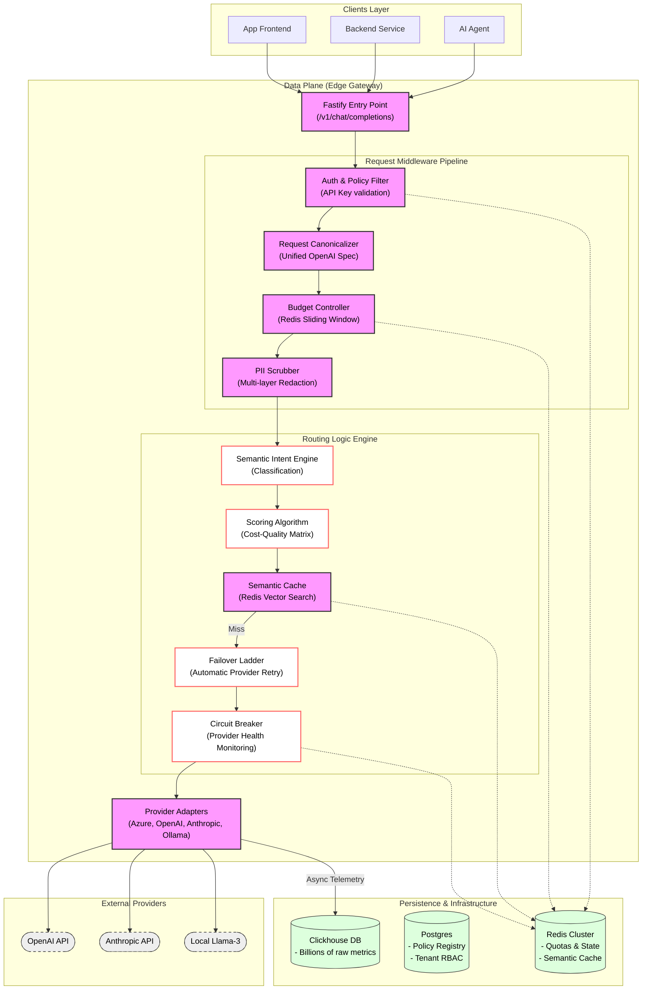

## The "Un-Bypassable" Edge Control Plane

In the rapid expansion of Enterprise AI, the "AI Wild West" has become a critical liability. API Saviour was engineered as a production-grade **Autonomous AI Control Plane**, designed to sit directly in the request hot-path between internal microservices and external LLM providers (OpenAI, Anthropic, Gemini).

As our internal traffic scaled to millions of tokens daily, we hit a "governance wall": 15 disconnected teams were shipping AI features with zero centralized oversight on costs, zero PII leakage guarantees, and no unified fallback strategy. API Saviour solves this by enforcing **Infrastructure-as-Policy**—every call to an LLM must pass through a strict, sub-millisecond architectural gauntlet.

---

### High-Level Architecture & Plane Separation

To maintain architectural purity and zero-added latency, the system is strictly bifurcated into a **Data Plane** and a **Control Plane**.

#### 1. The Data Plane (The Edge Gateway)
Built on a high-concurrency Fastify/Node.js shell, the Data Plane is responsible for the "hot-path" of token generation. It handles:
- **Request Canonicalization**: Normalizing various provider schemas (OpenAI vs Anthropic) into a unified internal representation.
- **Distributed Rate Limiting**: Orchestrated via Redis Lua scripts to ensure sub-millisecond quota checks across multiple gateway instances.
- **PII Redaction Engine**: A high-speed regex and lookup-based scrubber that identifies and scrubs sensitive data (emails, credit cards, keys) before they leave the secure VPC environment.

#### 2. The Control Plane (Governance Dashboard)
The "Brain" of the operation, where security and finance teams manage the AI landscape:
- **Dynamic Policy Registry**: Real-time updates to budget caps and provider hierarchies without gateway restarts.
- **The Plugin Marketplace**: A sandboxed environment where developers can write and deploy custom "Edge Logic" using an in-browser code editor.
- **Deep Telemetry Analytics**: Powered by a Clickhouse sink, providing per-tenant, per-model, and per-token cost visualization.



---

### Core Engineering Decisions & Implementation

#### 1. Distributed Rate Limiting via Lua Orchestration
One of our biggest hurdles was ensuring that a global "Budget Cap" remained accurate even with dozens of gateway nodes running in parallel. Standard polling would be too slow. Instead, we moved the logic into **Redis-native Lua scripts**. This ensures that the check-and-increment operations are atomic and execute directly in the memory layer, reducing network jitter and preventing budget "over-runs".

#### 2. The PII Scrubbing "Entropy" Engine
Security shouldn't be a speed bump. We built a high-performance **redactor** that uses a multi-pass approach:
- **First Pass**: Extremely fast Regex filters for structural data (SSNs, Card Numbers).
- **Second Pass**: Bloom filters to check against known sensitive dictionary terms.
- **Outcome**: Deterministic token scrubbing that ensures sensitive prompts never touch an external server while maintaining a sub-2ms processing overhead.

#### 3. Programmable Edge Plugins
We didn't want to hardcode every edge case. We implemented a **Plugin Engine** that allows developers to write custom middleware in TypeScript.
```typescript
// Example: Production-grade Prompt Injection Guard
export const InjectionGuard: EdgePlugin = {
  id: 'security-guard-v2',
  phase: 'pre-routing',
  execute: async (ctx) => {
    const isMalicious = await analyzeHateAndJailbreak(ctx.request.prompt);
    if (isMalicious) {
      return ctx.terminate(403, "Policy Violation: Malicious Prompt Detected");
    }
    return ctx.next();
  }
}
```

---

### Stability & The Request Lifecycle

The following sequence highlights the **Failover Matrix** logic. If the primary provider (e.g., GPT-4o) returns a 429 or 5xx, the gateway automatically executes a "fallback ladder" to ensure the application layer remains up, seamlessly switching to a secondary provider (e.g., Claude 3.5) with zero intervention from the client.

```mermaid
sequenceDiagram
    participant Client
    participant GW as Gateway (Fastify)
    participant Redis
    participant Router as Routing Engine
    participant Multi as Failover Ladder
    participant Provider as AI Provider (e.g. Anthropic)
    participant Telemetry as Telemetry Sink (Clickhouse)

    Note over Client, GW: Integrated via Unified SDK
    Client->>+GW: POST /v1/chat/completions
    
    rect rgb(30, 30, 40)
        Note right of GW: Security Phase
        GW->>Redis: Atomic Quota Check
        Redis-->>GW: OK (Tenant Under Limit)
        GW->>GW: Runtime PII Scrubbing
    end

    rect rgb(40, 30, 40)
        Note right of GW: Intelligence Phase
        GW->>Redis: Semantic Cache Lookup
        
        alt Semantic Cache Hit
            Redis-->>GW: Cached Response (95% overlap)
            GW-->>Client: 200 OK (latency < 40ms)
        else Cache Miss
            GW->>Router: Best Candidate selection
            Router-->>GW: Order: [Claude 3.5, GPT-4o]
            GW->>Multi: Execute Primary [0]
            
            alt Primary Success
                Multi->>Provider: Stream Token Buffer
                Provider-->>Multi: SSE Response
                Multi-->>GW: Stream Proxy
                GW-->>Client: SSE Stream
            else Primary Error (429/500)
                Note over Multi: Circuit Breaker: OPEN
                Multi->>Multi: Trigger Fallback [1] (GPT-4o)
                Multi->>Provider: Stream Request
                Provider-->>GW: SSE Buffer
                GW-->>Client: SSE Stream
            end
        end
    end

    rect rgb(30, 40, 30)
        Note right of GW: Evaluation Phase
        GW-)Telemetry: Write Performance Metrics (Async)
        GW-)Redis: Update Spend Counter (Atomic)
    end
    
    deactivate GW

```



---

### Outcomes, ROI & The Roadmap

The deployment of API Saviour completely transformed our AI operations from a "black box" into a high-visibility asset.

- **Economic Impact**: We achieved an immediate **28% reduction in total provider spend** through the implementation of Semantic Caching and the elimination of duplicate development queries across teams.
- **Security Posture**: Zero PII incidents reported since deployment. 100% of PII data is redacted at the network edge.
- **Operational Velocity**: Dev teams now onboard new LLM providers in minutes rather than weeks, as the gateway handles all authentication, canonicalization, and observability out-of-the-box.

#### Future Scale: The Next Frontier
Our roadmap includes **Model Distillation pipelines** where the gateway automatically "learns" from high-cost LLM outputs to train smaller, local models, further reducing reliance on external vendor APIs and driving costs toward zero.

> [!IMPORTANT]
> API Saviour isn't just a proxy—it is the **Operating System for Enterprise AI**. It proves that security and governance can be force multipliers for engineering velocity.
