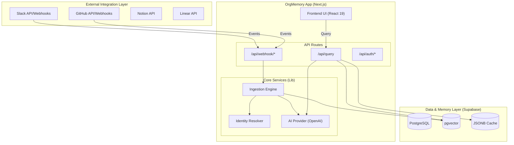
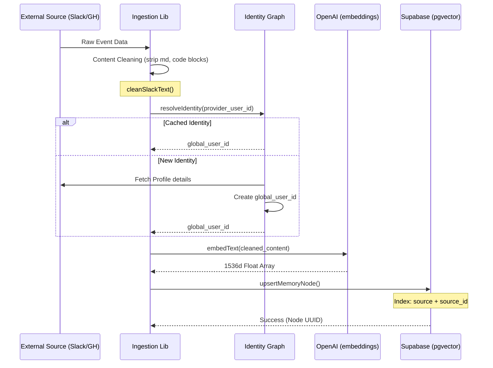
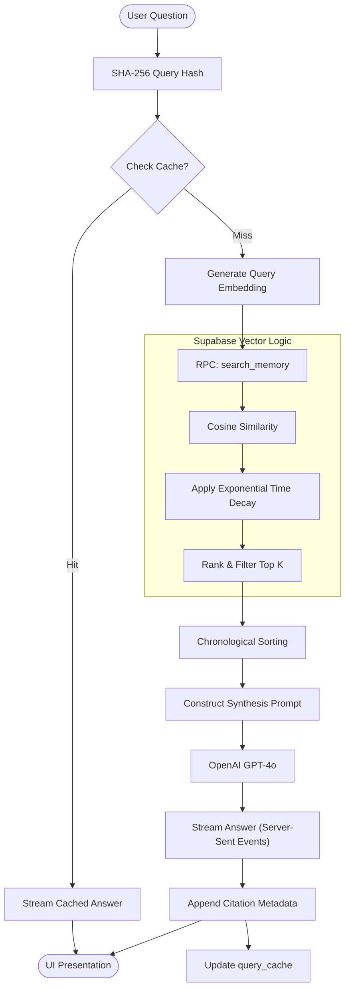
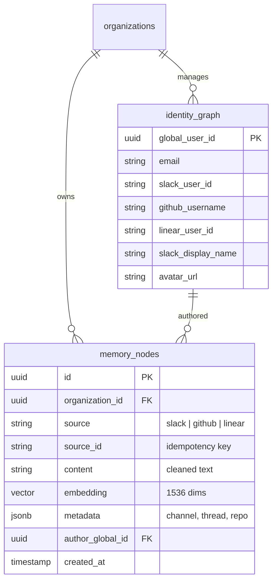

## Contextual Memory Store

When evaluating modern LLM workflows across different engineering teams, a recurring inefficiency emerged: every agent started with a completely blank slate. 

If Team A utilized an AI to summarize our microservices architecture on Tuesday, and Team B queried the exact same thing on Thursday, the LLM ran the full, expensive compute cycle twice. ORG-MEMORY was conceptualized and built to resolve this by providing a persistent, team-scoped semantic database — a shared "long-term memory" layer for our autonomous agents.

### The Hierarchical Data Protocol

The storage architecture of ORG-MEMORY is deliberately structured to support enterprise multi-tenancy rules:

1. **Workspaces:** The highest-level boundary, guaranteeing absolute memory isolation between different organizations or completely distinct tenant teams.
2. **Knowledge Contexts:** Sub-directories acting as topical buckets (e.g., "Architecture Decisions", "API Specs", "Post-Mortems").
3. **Memories:** The atomic units of context. Stored as raw text chunks, indexed with robust vector embeddings (using OpenAI's `text-embedding-3-small`).

When an LLM prepares a context window, it doesn't query the entire codebase. It sends a highly specific query to the ORG-MEMORY REST API, which responds by injecting the most relevant historical text seamlessly into the prompt before generation.

### Hybrid Search Implementation

A significant engineering hurdle was the limitation of pure sematic vector search. While incredible for conceptual matching, it notoriously fails at precise keyword queries (e.g., searching for a specific HTTP error code or git hash).

To solve this, ORG-MEMORY employs an advanced hybrid search strategy:

```typescript
// Generating the final relevance score using Reciprocal Rank Fusion
function RRFScore(semanticRank: number, keywordRank: number, k = 60): number {
  const denseScore = 1 / (k + semanticRank);
  const sparseScore = 1 / (k + keywordRank);
  return denseScore + sparseScore;
}
```

1.  **Dense Retrieval:** The system relies on Redis Stack handling HNSW indexing to retrieve documents based on semantic vector similarity.
2.  **Sparse Retrieval:** Simultaneously, a BM25 scoring layer sweeps over the text chunks to catch hard keyword hits.
3.  **Reciprocal Rank Fusion (RRF):** The lists are evaluated, merged using the mathematical constant `k=60`, and returned instantly to the calling agent.

### Security and Access Control

Because this database contains sensitive, organization-wide architecture decisions, role-based access control (RBAC) was deeply integrated into the retrieval logic. A query first executes a filter over the PostgreSQL metadata layer to ensure the API key has reading rights to the matched Workspace, only pushing authorized chunks into the embedding similarity engine.

### Technical Architecture

This section provides a detailed technical visualization of the OrgMemory architecture, covering the data lifecycle from ingestion to retrieval, the hybrid identity model, and the core synthesis engine.

#### 1. System Landscape
The high-level interaction between clients, the Next.js application server, AI providers, and the Supabase vector store.



#### 2. Ingestion Pipeline
How raw communication fragments are transformed into durable, searchable memory nodes.



#### 3. Query & Synthesis Engine
The flow of a natural language question through the retrieval-augmented generation (RAG) pipeline.



#### 4. Identity & Memory Schema
The relationship between users across different platforms and their generated memory fragments.



#### Architectural Maturity Labels

| Component | Status | Tech Stack |
| :--- | :--- | :--- |
| **Slack Ingestion** | ✅ Production Ready | Webhooks + History API |
| **Query Engine** | ✅ Internal Beta | GPT-4o + text-embedding-3-small |
| **Identity Graph** | 🟡 Partial | Slack-to-Email matching active |
| **GitHub/Linear** | ⚪ Scaffolded | Webhook handlers present, config pending |
| **Multi-tenancy** | ⚪ Placeholder | Organization IDs implemented, Auth pending |

### Impact on Scale

> [!IMPORTANT]  
> "The implementation of ORG-MEMORY fundamentally altered our AI orchestration strategy."

By introducing a single, verified source-of-truth semantic memory store:
* We documented a **40% reduction in token burn** across repetitive analysis queries.
* We eliminated AI hallucinations regarding internal tooling because the LLMs always had immediate access to our ground-truth documentation.
